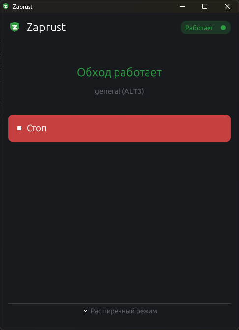
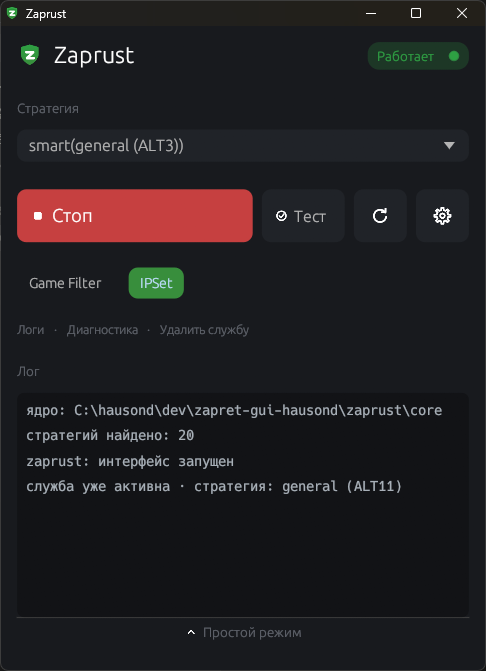

# Zaprust

**Лёгкий нативный GUI для обхода DPI-блокировок** (Discord, YouTube, Telegram и др.) поверх движка [zapret](https://github.com/bol-van/zapret) и сборки стратегий [Flowseal/zapret-discord-youtube](https://github.com/Flowseal/zapret-discord-youtube). Написан на **Rust + egui**, один статический бинарь без webview и сторонних рантаймов.

**Кроссплатформенный — Windows и Linux из одной кодовой базы.** Платформенно-зависимый код спрятан за трейтами; общими остаются GUI, выбор стратегии, оркестрация, автоподбор, конфиг и логи. Меняются только примитивы под капотом:

| | **Windows** | **Linux** |
|---|---|---|
| Движок | `winws.exe` | `nfqws` (демон) |
| Перехват пакетов | WinDivert (в аргументах winws) | nftables/iptables → NFQUEUE (отдельно от демона) |
| Элевация | UAC (`ShellExecuteExW("runas")`) | pkexec (polkit) |
| Служба + автозапуск | `sc create … start=auto` | systemd-юнит (`WantedBy=multi-user.target`) |
| Тест доступности | native-tls (SChannel) | rustls |
| Поставка | портабл-zip | AppImage |

> Zaprust — **оболочка, не движок**. Трафик обрабатывают сторонние бинарники zapret (`winws.exe` + `WinDivert` на Windows, `nfqws` на Linux); Zaprust лишь управляет ими через системную службу. Сам код zapret в репозиторий не входит — ядро тянется кнопкой «Скачать ядро».

---

## Возможности

- **Простой режим (по умолчанию):** одна кнопка — нажал «Старт», приложение само **подбирает рабочую стратегию** (smart-автоподбор) и ставит её службой на постоянку.
- **Smart-автоподбор:** гоняет каждую стратегию реальным движком, отсеивает провалившие по TLS-хендшейку (fail-fast), среди прошедших выбирает с наименьшим пингом до YouTube и Discord. Одна элевация на весь подбор. Запоминает победителя (last-known-good) для мгновенного повторного старта.
- **Расширенный режим:** ручной выбор стратегии (включая виртуальную `smart`), тумблеры Game Filter / IPSet, кнопка «Тест» (проверка доступности доменов), живой лог событий.
- **Служба + автозапуск:** после перезагрузки обход поднимается сам.
- **Элевация по требованию:** GUI работает без прав администратора/root; права запрашиваются только на привилегированные операции (служба, замена ядра) — один диалог (UAC / polkit).
- **Апдейтер ядра:** подтягивает свежий релиз целиком (движок + стратегии + списки), сохраняя пользовательские `*-user.txt`.
- **Редактор списков (⚙):** правка `core/lists/*.txt` прямо в окне, сохранение и откат к стандартному списку из релиза.
- **Логирование и диагностика:** все процессы пишут в один `zaprust.log`; panic-hook ловит крэши; кнопки «Открыть папку логов» и «Скопировать диагностику».

## Скриншоты

| Простой режим | Расширенный режим |
|:---:|:---:|
|  |  |
| Одна кнопка — приложение само подбирает рабочую стратегию | Ручной выбор стратегии, тумблеры, тест доменов, живой лог |

---

## Windows

### Запуск

1. Скачайте `Zaprust-<версия>-windows-x86_64.zip` из [релизов](https://github.com/hausond/Zaprust/releases) и распакуйте в путь **без пробелов, кириллицы и спецсимволов** (напр. `C:\Zaprust\`).
2. Запустите `zaprust.exe`. При отсутствии ядра — «Скачать ядро» (подтянется сборка Flowseal: `winws.exe`, `WinDivert`, стратегии, списки).
3. «Старт» → один **UAC** → служба `zapret` ставится с автозапуском, обход поднимается и переживает перезагрузку.

Подробная пользовательская инструкция кладётся в zip — [PACKAGE_README.txt](PACKAGE_README.txt).

### Что под капотом

- **service-only модель:** прямого запуска `winws` в пользовательском режиме нет — Старт всегда ставит службу `zapret` (`sc create … start=auto`, `winws` прописан в `binPath` напрямую, инлайн, не через `.bat`), Стоп — останавливает и удаляет её.
- **Весь фильтр трафика — в аргументах `winws`** (WinDivert внутри них): порты `--wf-tcp`/`--wf-udp` + desync-флаги.
- **Стратегии** — парсятся из `general*.bat` сборки Flowseal.

### Антивирус удаляет файлы ядра (ложное срабатывание)

Самая частая жалоба на Windows. Антивирус (чаще Windows Defender) детектит и **удаляет файлы ядра zapret** — `winws.exe`, драйвер `WinDivert64.sys` / `WinDivert.dll` — как `HackTool` / `PUA:Win32/Zapret` / `RiskTool`. Это **ложное срабатывание**, общее для всех инструментов на базе zapret: WinDivert — легальный драйвер перехвата трафика, но эвристика помечает любой DPI-обходчик как «потенциально нежелательный». Правкой кода Zaprust это не лечится — флагаются сторонние бинарники ядра.

Что делать:

1. Восстановить файлы из карантина: «Безопасность Windows» → «Журнал защиты» → «Восстановить».
2. Добавить папку Zaprust в исключения: «Защита от вирусов и угроз» → «Управление настройками» → «Исключения» → «Добавить исключение» → «Папка». Или из PowerShell (админ):
   ```powershell
   Add-MpPreference -ExclusionPath "C:\Zaprust"
   ```
3. Заново «Скачать ядро» (если файлы удалялись) и «Старт».

Сторонний антивирус — то же самое в его настройках. Полностью убрать детект можно лишь подписью кода (EV-сертификат) — при каждом обновлении ядра хеш меняется, поэтому исключение папки практически неизбежно.

### Сборка (Windows)

Собирается под **GNU-toolchain** (не MSVC), чтобы не требовать Visual Studio Build Tools; линковка статическая.

1. Rust GNU: `rustup default stable-x86_64-pc-windows-gnu`.
2. [w64devkit](https://github.com/skeeto/w64devkit/releases) (полный mingw-w64) — распаковать, напр., в `C:\w64devkit`.
3. Заглушка `libgcc_eh.a` (в GCC 16 он слит в `libgcc.a`, а Rust всё ещё передаёт `-lgcc_eh`):
   ```powershell
   $env:Path = "C:\w64devkit\bin;$env:Path"
   $gccver = (gcc -dumpversion)
   Push-Location "C:\w64devkit\lib\gcc\x86_64-w64-mingw32\$gccver"; ar crs libgcc_eh.a; Pop-Location
   ```
4. `cargo build --release` (иконка/манифест вшиваются через `build.rs`). Готовый exe запускается на чистой машине без w64devkit.

Портабл-zip: `zaprust.exe` + `PACKAGE_README.txt` (ядро не вкладывается).

---

## Linux

### Запуск

Поставляется одним файлом **AppImage**:

```bash
chmod +x Zaprust-*-x86_64.AppImage
./Zaprust-*-x86_64.AppImage
```

1. При отсутствии ядра — «Скачать ядро» (стратегии Flowseal + движок `nfqws` в `~/.local/share/zaprust`; в read-only образ ядро не вкладывается).
2. «Старт» → один диалог **polkit** (root для правил фаервола и службы) → простой режим сам подберёт стратегию → обход переживает перезагрузку.

### Что под капотом

Главное отличие от Windows: **движок не самодостаточен.** `nfqws` сам ничего не перехватывает — правила **nftables/iptables** заворачивают исходящий трафик (tcp 80,443; udp 443 + порты стратегии) в очередь **NFQUEUE**, откуда демон его читает. Поэтому **Старт = правила фаервола + запуск демона**, **Стоп = глушим демон + снимаем правила.**

- **Служба** — свой systemd-юнит `/etc/systemd/system/zaprust.service`, чей `ExecStart` реинвокает наш же бинарь с выбранной стратегией (стратегия — единый источник правды).
- **Элевация** — `pkexec`: привилегированные операции идут отдельным root-процессом, результат возвращается файлом-хэндшейком.
- **Бэкенд фаервола** выбирается сам: `nft` → `iptables-nft` → `iptables-legacy` → `iptables`.

### Зависимости системы

На любом современном десктопе уже есть: **polkit** (`pkexec`), **systemd**, **nftables** (или iptables), **X11/Wayland + OpenGL** (egui грузит их через `dlopen`, в образ не вкладываются). Если нет **libfuse2** — запуск без FUSE: `./Zaprust-*.AppImage --appimage-extract-and-run`.

### Логи

`~/.local/state/zaprust/logs/zaprust.log` (XDG). В расширенном режиме — «Открыть папку логов» / «Скопировать диагностику».

### Сборка (Linux)

```bash
sudo apt install -y libxkbcommon-dev libwayland-dev libxcb1-dev \
  libxcb-render0-dev libxcb-shape0-dev libxcb-xfixes0-dev libgl1-mesa-dev
cargo build --release
packaging/linux/build-appimage.sh        # → dist/Zaprust-<ver>-x86_64.AppImage
```

📖 **Полное Linux-руководство** (Wayland/X11, FUSE, восстановление сети, детали AppImage) — в **[docs/LINUX.md](docs/LINUX.md)**.

---

## Архитектура

- **Единая кодовая база, не форк.** Платформенный слой за трейтами в `src/platform/` (`Paths`, `Elevator`, `StrategySource`, `ServiceController`, `StatusProbe`, `BypassRuntime`, `Tester`, объединённые супертрейтом `Platform`). Доступ — через `platform::host()`, выбор реализации — на `#[cfg]`.
- **Элевация = реинвок самого бинаря** (runas / pkexec). Привилегированная работа — в отдельном элевированном процессе, результат через temp-файл (одинаково на обеих ОС).
- **Главный поток рисует UI.** Сеть, пробы, апдейтер, элевированные операции — в фоновых потоках; обмен с UI через `mpsc` и atomics.
- **TLS-тест за `#[cfg]`:** Windows — native-tls (SChannel), Linux — rustls (без системного OpenSSL — важно для переносимого AppImage).

### Внутренние CLI-режимы (реинвок/диагностика)

| Флаг | Назначение | Платформа |
|------|------------|:---:|
| `--svc <install\|remove\|start\|stop\|uninstall> …` | элевированные операции со службой | обе |
| `--autoselect <gf> [lkg]` | элевированный автоподбор стратегии | обе |
| `--apply-update <zip> <tag> …` | элевированная замена ядра | обе |
| `--write-list <dest> <src>` | элевированная запись файла списка | обе |
| `--svc-run <стратегия> <gf>` | тело systemd-службы (`ExecStart`) | Linux |
| `--engine-up [стратегия]` / `--engine-down` | ручной foreground-прогон / аварийное снятие правил | Linux |
| `--dump-args "<стратегия>"` | показать итоговый argv движка | обе |
| `--test-run "<стратегия>"` · `--test-net` | прогон движка ~4с / тест доменов | обе |
| `--update-dry` · `--fetch-core [dir]` | проверка апдейтера / получения ядра | обе |
| `--diag` · `--install-desktop` | сводка окружения / установка `.desktop` + иконки | обе / Linux |
| `--test-elevate [args…]` | проверка элевации + файл-хэндшейка | обе |

---

## Релизы и CI

`.github/workflows/release.yml` по пушу тега `vX.Y.Z` собирает **оба** артефакта и прикладывает их к **одному** GitHub-релизу:

- **Windows** (`windows-latest`) → `Zaprust-<ver>-windows-x86_64.zip`;
- **Linux** (`ubuntu-22.04`, старый glibc ради совместимости) → `Zaprust-<ver>-x86_64.AppImage`.

```bash
git tag v0.2.0 && git push origin v0.2.0   # → сборка обеих платформ и публикация релиза
```

Без тега (ручной запуск / push в ветку) workflow только собирает и кладёт артефакты в run, релиз не трогая.

## Структура репозитория

```
.
├── README.md  LICENSE  PACKAGE_README.txt
├── Cargo.toml  Cargo.lock  build.rs
├── .github/workflows/release.yml   ← CI: Windows-zip + Linux-AppImage в один релиз
├── assets/icons/                   ← иконки интерфейса + логотип
├── docs/
│   ├── LINUX.md                    ← руководство по Linux
│   ├── deviations.md               ← отступления от изначального плана (Windows)
│   └── screenshots/
├── packaging/linux/                ← .desktop, build-appimage.sh, polkit-policy
└── src/
    ├── main.rs                     ← UI, оркестрация, реинвок-команды, автоподбор
    ├── config.rs  logging.rs       ← персист настроек, логгер + panic-hook
    ├── updater.rs                  ← апдейтер ядра (GitHub API + zip)
    ├── strategies.rs  bat.rs       ← общие типы Strategy/CoreScan, парсер Flowseal .bat
    └── platform/
        ├── mod.rs                  ← трейты + host()
        ├── windows/                ← sc / runas / WinDivert / winws / native-tls
        └── linux/                  ← systemd / pkexec / nftables / nfqws / rustls / desktop
```

`target/`, `dist/`, `logs/`, `core/` — в репозиторий **не** попадают (см. `.gitignore`).

---

## Благодарности и дисклеймер

- [**bol-van/zapret**](https://github.com/bol-van/zapret) — движок обхода DPI (на Linux используется напрямую: `nfqws`).
- [**Flowseal/zapret-discord-youtube**](https://github.com/Flowseal/zapret-discord-youtube) — подобранные стратегии, списки и сборка под Windows.

Zaprust — независимый сторонний GUI и **не аффилирован** с bol-van или Flowseal.

## Лицензия

Исходный код Zaprust распространяется под лицензией [MIT](LICENSE).

Zaprust — отдельная оболочка и **не включает** код zapret. Движок (`winws.exe`/`nfqws`, драйвер WinDivert) и стратегии/списки поставляются [bol-van/zapret](https://github.com/bol-van/zapret) и [Flowseal/zapret-discord-youtube](https://github.com/Flowseal/zapret-discord-youtube) под их собственными лицензиями — действие лицензии Zaprust на них не распространяется.
